# KC7 Cyber Threat Intelligence Investigations

This repository contains my completed investigations, badges, certificates, and KQL queries from the KC7 Cyber Threat Intelligence platform.  
It serves as a structured portfolio demonstrating skills in:

- Threat investigation  
- Log analysis  
- KQL query development  
- Network and authentication telemetry analysis  
- Passive DNS pivoting  
- CTI frameworks (MITRE ATT&CK, Diamond Model)  
- Reporting and documentation  

All investigations are fully documented, with supporting KQL queries and earned badges included.

---

## Repository Structure
```
kc7-investigations/
│
├── investigations/                     # Each investigation in its own folder
│   ├── valdoria-voting-machines/
│   │   ├── valdoria-voting-machines-report.md
│   │   └── valdoria-voting-machines-kql.md
│   ├── encryptodera-insider-ransomware/
│   │   ├── encryptodera-insider-ransomware-report.md
│   │   └── encryptodera-insider-ransomware-kql.md
│   └── ... future investigations ...
│
├── badges/                             # Investigation and streak badges
│   ├── investigations/
│   └── streaks/
│
└── certificates/                       # KC7 certificates earned
```

---

## Completed Investigations
- [Valdoria Voting Machines](investigations/valdoria-voting-machines/valdoria-voting-machines-report.md)
- [Encryptodera Insider Ransomware](investigations/encryptodera-insider-ransomware/encryptodera-insider-ransomware-report.md)


---

## KQL Index

- [Valdoria Voting Machines KQL](investigations/valdoria-voting-machines/valdoria-voting-machines-kql.md)
- [Encryptodera Insider Ransomware KQL](investigations/encryptodera-insider-ransomware/encryptodera-insider-ransomware-kql.md)

<!-- Add new KQL links here as you complete more investigations -->

---

## Investigation Badges

<div style="display: flex; flex-wrap: wrap; gap: 20px; align-items: center;">

  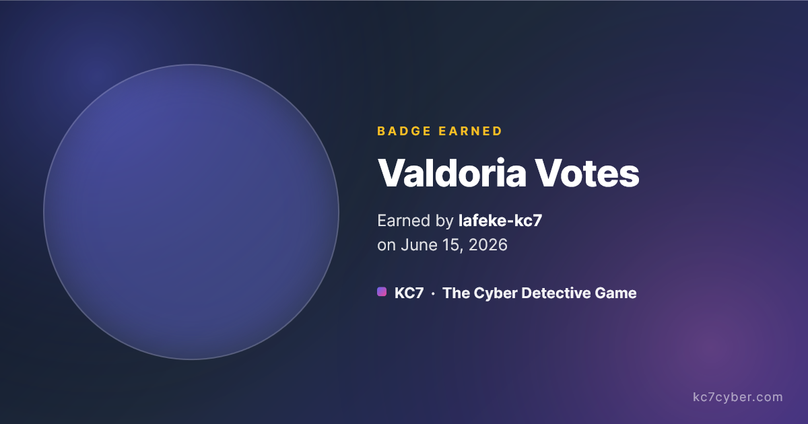
  
  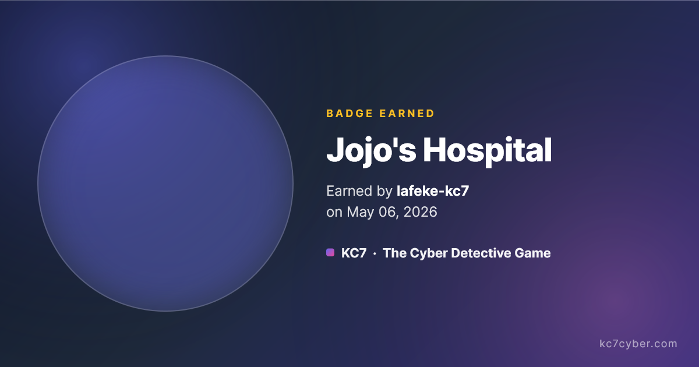
  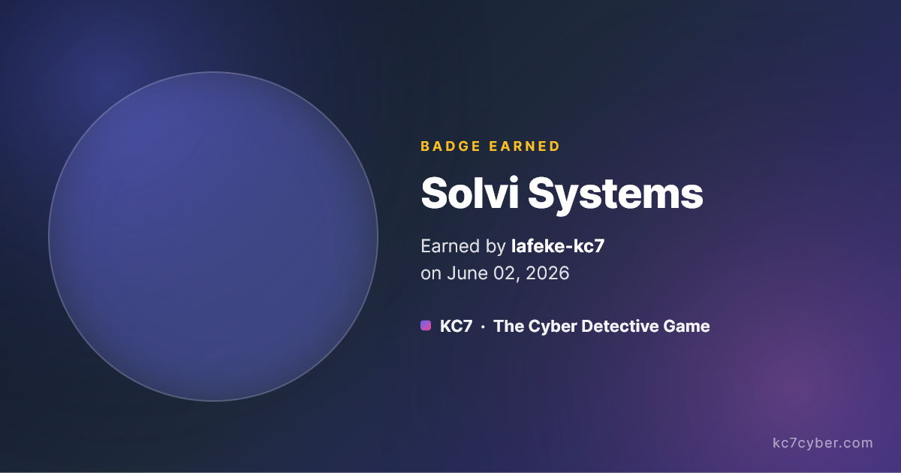
  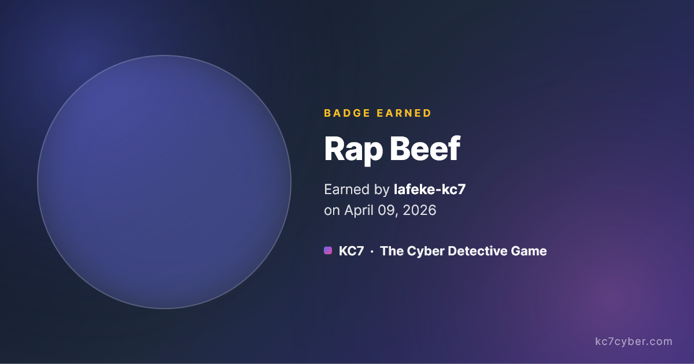
  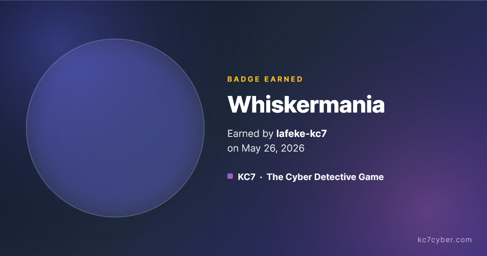
  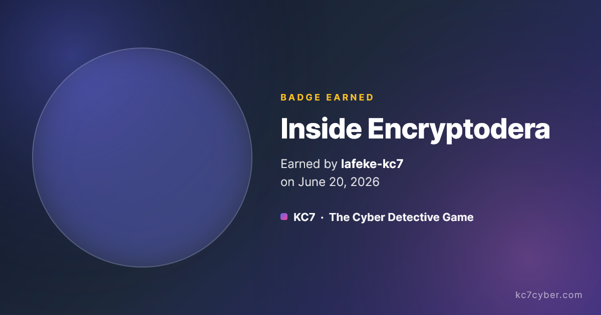

</div>

---

## Streak Badges

<div style="display: flex; flex-wrap: wrap; gap: 20px; align-items: center;">

  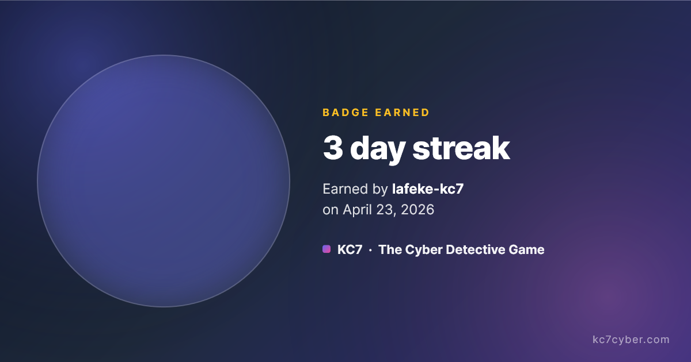
  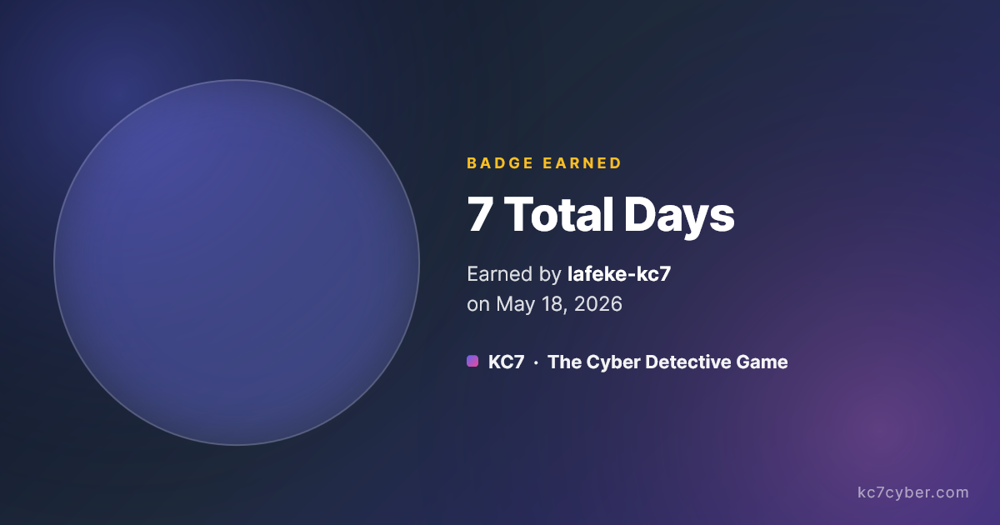
  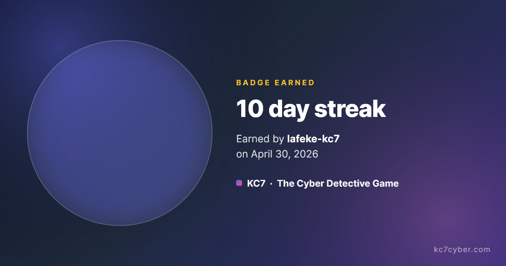
  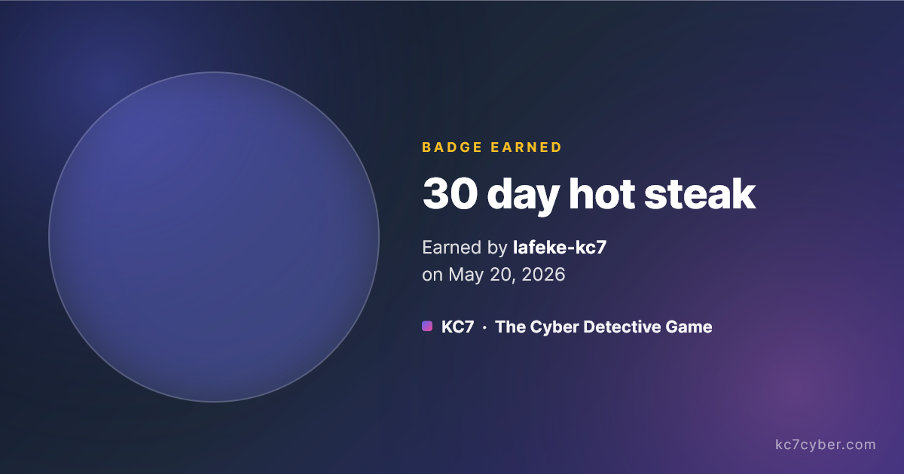
  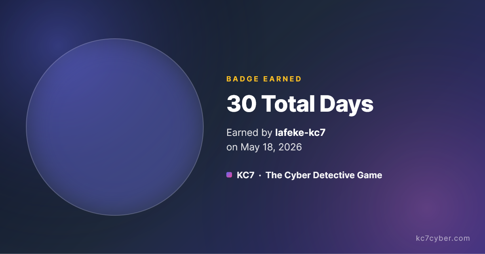
  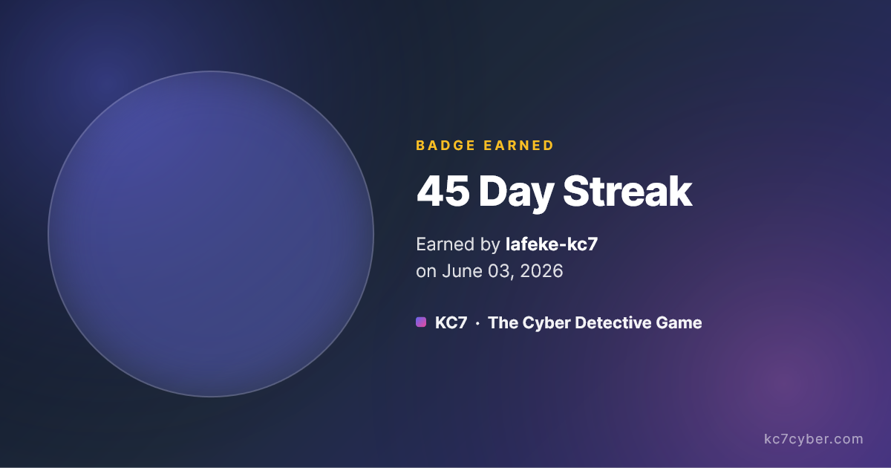

</div>

---

## Certificates

<div style="display: flex; flex-wrap: wrap; gap: 20px; align-items: center;">

  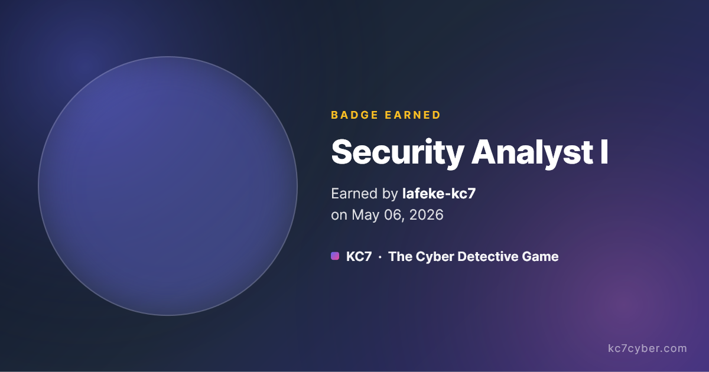
  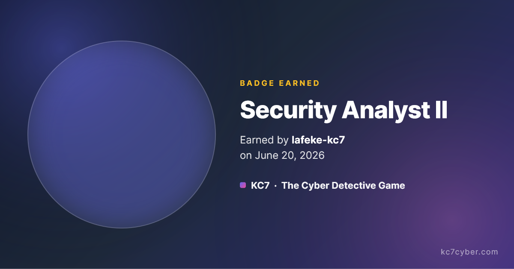
  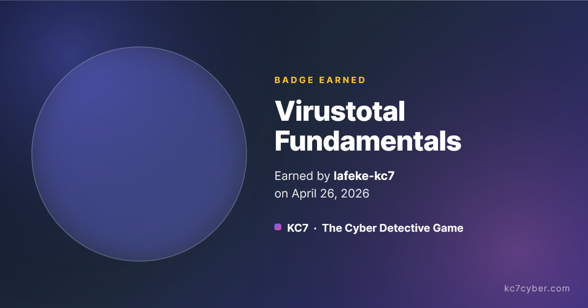

</div>

---

## KC7 Public Profile

KC7 provides a public profile that tracks my investigations, streaks, and overall progress:

https://kc7cyber.com/profile/lafeke-kc7

---

## Skills Demonstrated

- KQL (Kusto Query Language)  
- Threat investigation workflows  
- Network telemetry analysis  
- Authentication log analysis  
- Passive DNS pivoting  
- Phishing analysis  
- Identity‑based intrusion analysis  
- MITRE ATT&CK mapping  
- Diamond Model application  
- CTI reporting and documentation  

---

## Contact

If you would like to discuss my KC7 work, CTI, detection engineering, or security analysis, feel free to reach out.
